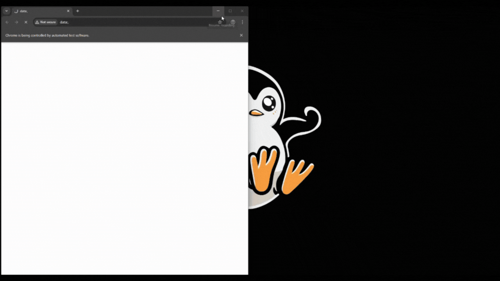

# Recaptcha Audio Bypass

## Objective
The objective of this project is to demonstrate that it is possible to look at problems in a different way. By using lateral thinking, we can find alternative solutions to challenges that may seem straightforward or rigid.

## Disclaimer
**Important:** This project is for educational and demonstration purposes only. It is **not** intended for causing harm, bypassing security measures for malicious intent, or any other negative purposes. Please use this code responsibly.

## Demonstration
Here is a video demonstration of the project in action:



## How to Run
1.  Ensure you have Python installed.
2.  Install the required dependencies:
    ```bash
    pip install selenium webdriver-manager pyautogui keyboard pyperclip
    ```
3.  Run the script:
    ```bash
    python main.py
    ```

**Note:** The script uses `pyautogui` which relies on screen coordinates. You may need to adjust the coordinates in `main.py` to match your screen resolution and layout.
